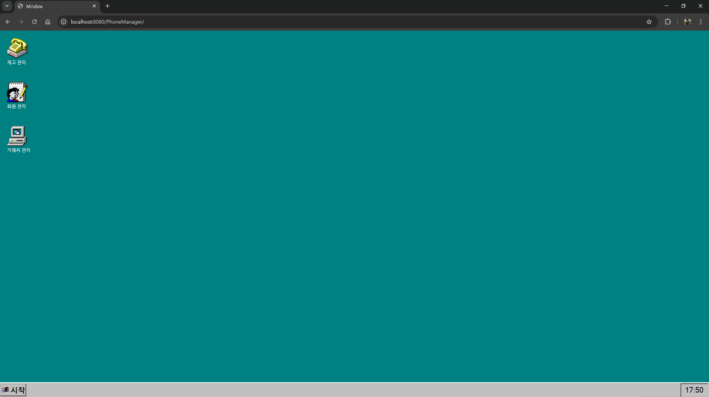
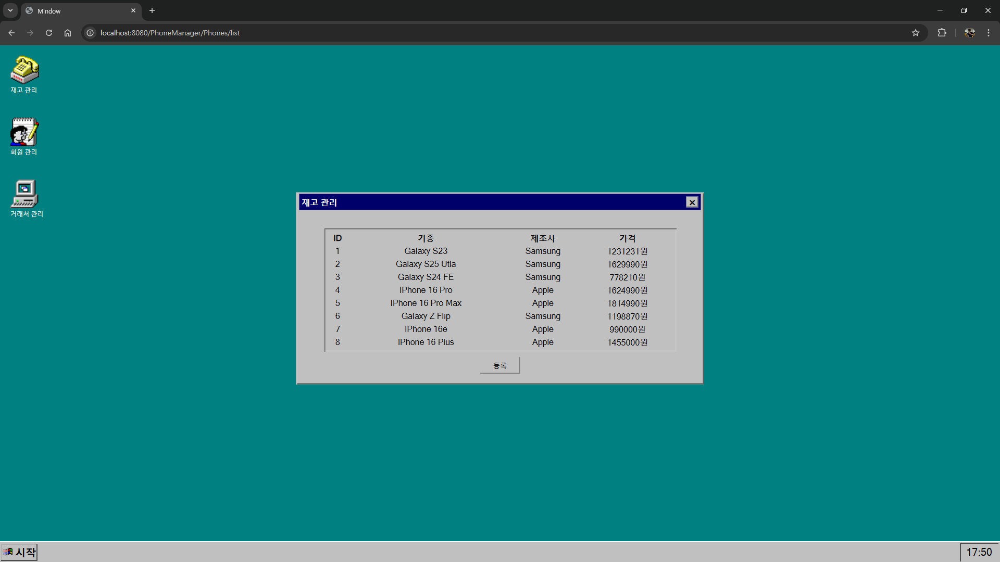
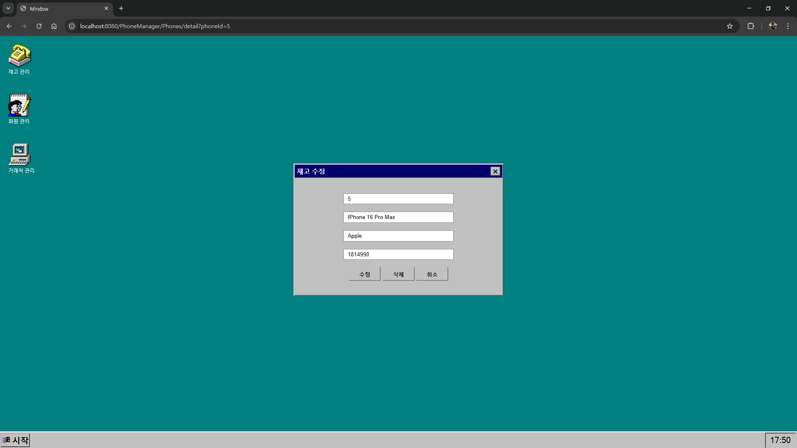
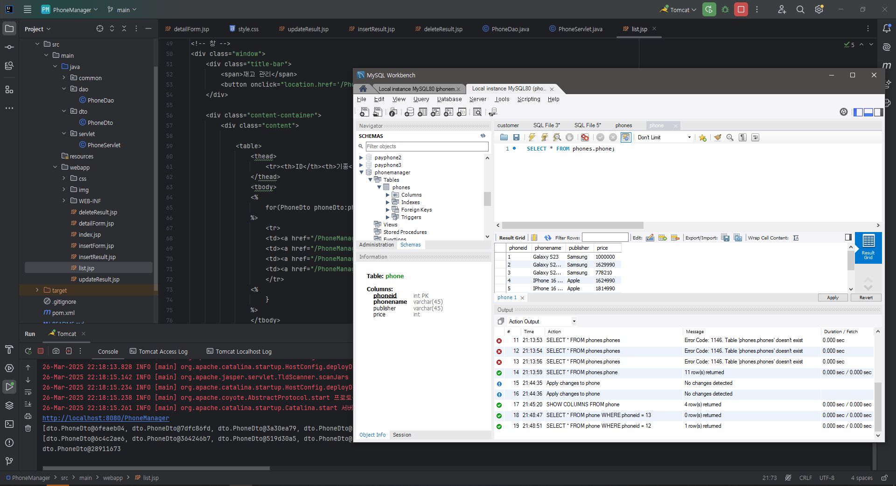

# PhoneManager
> LG U+ URECA Servlet/JSP(MVC) 실습  
> 25.03.26 ~ 25.03.26

## 프로젝트 소개
휴대폰 목록을 생성, 조회, 수정, 삭제하는 프로그램입니다.  
그런데 Servlet과 JSP를 곁들인

당연히 CRUD 완벽하게 작동합니다.

## 기술 스택
| 분야       | 기술               |
|----------|-------------------|
| FrontEnd | HTML/CSS |
| BackEnd  | Java, MySQL, Servlet, JSP |

## 이미지
  
  
  
